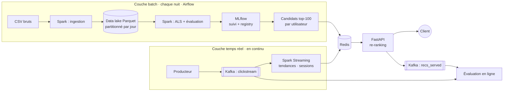

# Système de recommandation e-commerce hybride (batch + temps réel)

Moteur de recommandation qui apprend les **goûts durables** de chaque utilisateur chaque nuit
(Spark, ALS), capte son **intention du moment** en temps réel (Kafka, Spark Structured Streaming)
et combine les deux dans une API (FastAPI). Le réentraînement est orchestré par **Airflow** et le
cycle de vie des modèles est géré par **MLflow**.

> **Question à laquelle répond le système :** « Pour cet utilisateur, à cet instant, quels sont les
> 10 produits qu'il a le plus de chances d'ajouter au panier ou d'acheter ? »

**Stack :** Apache Spark 3.5 · Kafka · Airflow · MLflow · Redis · FastAPI · Docker · Parquet

---

## Sommaire

1. [Architecture cible](#architecture-cible)
2. [Pourquoi chaque outil](#pourquoi-chaque-outil)
3. [Les données](#les-données)
4. [Avancement](#avancement)
5. [Démarrage rapide](#démarrage-rapide)
6. [Résultats de l'ingestion](#résultats-de-lingestion)
7. [Décisions de conception](#décisions-de-conception)
8. [Structure du dépôt](#structure-du-dépôt)

---

## Architecture cible

Octobre 2019 joue le rôle de **l'historique** (traité en batch), novembre 2019 celui du **présent**
(rejoué dans Kafka comme du trafic en direct).



## Pourquoi chaque outil

Chaque outil est là parce que le problème l'exige, pas pour la liste de compétences.

| Outil | Rôle ici | Pourquoi une solution plus simple ne suffit pas |
|---|---|---|
| **Spark** | Ingestion, construction des interactions, entraînement ALS, génération des candidats | 110 M d'événements ne tiennent pas en mémoire avec Pandas ; ALS est conçu pour le calcul distribué |
| **Parquet** | Format du data lake | Format colonne, compressé et typé : une requête sur un jour ne lit qu'un dossier et que les colonnes utiles |
| **Kafka** | Flux de clics en direct, journal des recommandations servies | Découple producteurs et consommateurs, garantit l'ordre par utilisateur, permet de rejouer après une panne |
| **Spark Structured Streaming** | Produits tendance et sessions en cours | Fenêtres temporelles, gestion des retards (watermark) et reprise après panne, sans tout réécrire |
| **Airflow** | Pipeline nocturne : ingestion → qualité → entraînement → promotion → chargement | Dépendances entre tâches, relance jour par jour, historique et alertes |
| **MLflow** | Suivi des expériences, registry, alias `champion` | Ne promouvoir un modèle que s'il bat celui en production |
| **Redis** | Candidats, sessions, tendances | Lectures en moins d'une milliseconde pour l'API |
| **Docker Compose** | Toute la plateforme en une commande | Environnement identique sur toutes les machines |

## Les données

Dataset public [eCommerce behavior data from multi category store](https://www.kaggle.com/datasets/mkechinov/ecommerce-behavior-data-from-multi-category-store)
(REES46 / Open CDP) : chaque ligne est un événement **vue**, **ajout au panier** ou **achat**.

| Fichier | Taille | Événements |
|---|---|---|
| `2019-Oct.csv` | 5,3 Go | 42 448 764 |
| `2019-Nov.csv` | 8,4 Go | 67 501 979 |

Répartition des événements en octobre : **96,07 % de vues**, 2,18 % d'ajouts au panier,
1,75 % d'achats. Le signal fort (achat) est rare, d'où la pondération des événements prévue
pour le modèle.

## Avancement

- [x] **Semaine 1 : fondations**
  - [x] Environnement (WSL2, Docker) et squelette du dépôt
  - [x] Téléchargement reproductible des données (`scripts/download_data.sh`)
  - [x] Cluster Spark dans Docker (master, worker, client Jupyter)
  - [x] Ingestion CSV → data lake Parquet (validation, quarantaine, dédoublonnage, rapport qualité)
  - [ ] Exploration des données
  - [ ] Tests unitaires et intégration continue
- [ ] **Semaine 2 :** interactions, découpage temporel, baseline de popularité, ALS, Recall@10
- [ ] **Semaine 3 :** MLflow (suivi, recherche d'hyperparamètres, registry)
- [ ] **Semaine 4 :** Kafka, producteur, Spark Streaming → Redis (pipeline de bout en bout)
- [ ] **Semaine 5 :** DAG Airflow complet (challenger vs champion)
- [ ] **Semaine 6 :** API FastAPI, re-ranking, évaluation en ligne
- [ ] **Semaine 7 :** tableau de bord, monitoring, documentation finale

## Démarrage rapide

**Prérequis :** Docker Desktop (WSL2 sous Windows) et une clé API Kaggle dans `~/.kaggle/kaggle.json`.

```bash
# 1. Télécharger les données (~4,3 Go compressés, une seule fois)
bash scripts/download_data.sh

# 2. Adapter les ressources Spark à sa machine
cp .env.example .env

# 3. Construire l'image et démarrer le cluster Spark
docker compose build
docker compose up -d

# 4. Vérifier que le cluster fonctionne (compte les 42 M d'événements d'octobre)
docker compose exec spark-client spark-submit spark_jobs/smoke_test.py data/raw/2019-Oct.csv

# 5. Construire le data lake Parquet, un mois à la fois
docker compose exec spark-client spark-submit spark_jobs/ingest.py --input data/raw/2019-Oct.csv
docker compose exec spark-client spark-submit spark_jobs/ingest.py --input data/raw/2019-Nov.csv

# 6. (Optionnel) Comparer CSV et Parquet sur une même requête
docker compose exec spark-client spark-submit spark_jobs/benchmark_formats.py --date 2019-11-15
```

Pour tester rapidement sur une machine modeste : `--sample-pct 5` ne garde que 5 % des utilisateurs.

| Interface | Adresse |
|---|---|
| Spark master | http://localhost:8090 |
| Spark worker | http://localhost:8081 |
| Job Spark en cours | http://localhost:4040 |
| JupyterLab | http://localhost:8888 |

## Résultats de l'ingestion

| | Octobre | Novembre | Total |
|---|---|---|---|
| Lignes lues | 42 448 764 | 67 501 979 | 109 950 743 |
| Lignes rejetées (sans session) | 2 | 10 | 12 |
| Doublons supprimés | 30 220 (0,07 %) | 100 530 (0,15 %) | 130 750 |
| **Événements dans le lake** | **42 418 542** | **67 401 439** | **109 819 981** |
| Jours (partitions) | 31 | 30 | 61 |

| Mesure | CSV brut | Data lake Parquet |
|---|---|---|
| Taille sur disque | 14 Go | _à compléter_ Go |
| « Achats par catégorie le 15/11 » | _à compléter_ s | _à compléter_ s (**×_à compléter_**) |

Observations :
- novembre compte **64 % d'événements par jour de plus** qu'octobre (hypothèse : période du Black Friday, à vérifier lors de l'exploration) ;
- le taux de doublons double en novembre, peut-être à cause de la charge sur le système de suivi.

## Décisions de conception

| Décision | Raison |
|---|---|
| **Schéma imposé** plutôt que `inferSchema` | Évite une relecture complète des 14 Go et les changements de type silencieux |
| **Architecture médaillon** : `raw` (bronze) → `lake` (silver) → agrégats (gold) | Les données brutes ne sont jamais modifiées ; on peut toujours tout reconstruire |
| **Quarantaine** des lignes invalides, avec leur motif | On ne supprime jamais de données en silence ; chaque rejet est traçable |
| **Rapport qualité JSON** à chaque exécution | Lignes lues = rejetées + doublons + écrites : aucune ligne perdue sans explication |
| **Partitionnement par jour** + `partitionOverwriteMode=dynamic` | Ingestion **idempotente** : relancer une journée ne réécrit que cette journée (base du futur DAG Airflow) |
| **Un fichier par jour** (`repartition` avant l'écriture) | Évite le problème des milliers de petits fichiers |
| **Échantillonnage par utilisateur** (hachage de `user_id`) | Garde des historiques complets et reproductibles, contrairement à un échantillonnage de lignes |
| **Tout en UTC** | Un événement de 23h30 UTC ne bascule pas au jour suivant |
| **Aucune UDF Python** | Toutes les transformations s'exécutent dans le moteur Java de Spark, 10 à 100 fois plus vite |
| **Une seule image Docker** pour le master, le worker et le client | Driver et executors doivent avoir exactement les mêmes versions de Python et de PySpark |

## Structure du dépôt

```
ecommerce-reco/
├── docker-compose.yml          cluster Spark (master, worker, client Jupyter)
├── .env.example                ressources Spark à adapter (copier en .env)
├── docker/spark/               image Spark commune (Python 3.11, Java 17, PySpark 3.5)
├── conf/spark/                 configuration Spark partagée (UTC, shuffle, logs)
├── scripts/
│   └── download_data.sh        téléchargement reproductible depuis Kaggle
├── spark_jobs/
│   ├── lib/
│   │   ├── schema.py           schéma imposé des CSV bruts
│   │   ├── transforms.py       nettoyage, validation, échantillonnage, dédoublonnage
│   │   └── session.py          création de la session Spark
│   ├── ingest.py               CSV → data lake Parquet + quarantaine + rapport qualité
│   ├── benchmark_formats.py    CSV vs Parquet sur une même requête
│   └── smoke_test.py           test de bon fonctionnement du cluster
├── data/                       (non versionné) raw/, lake/, quarantine/
└── reports/                    (non versionné) rapports d'ingestion
```